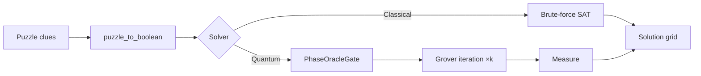

# Quantum Nonogram Solver

Solve [nonogram](https://en.wikipedia.org/wiki/Nonogram) (Picross) puzzles using classical brute-force **and** Grover's quantum search algorithm — then compare the two side-by-side. The project ships with a **browser-based web UI**, a Python library, Jupyter notebooks, and support for running circuits on **real IBM quantum hardware** via Qiskit Runtime.

```
Example: 4×6 puzzle              Solution:
Row clues:  (1,1), (2,2),        ╔══════╗
            (1,2,1), (1,1)       ║■□□□□■║
Col clues:  (4),(1),(1),         ║■■□□■■║
            (1),(1),(4)          ║■□■■□■║
                                 ║■□□□□■║
                                 ╚══════╝
```

---

## Features

- **Classical solver** — exhaustive brute-force SAT search over all 2^(n×d) candidate grids
- **Quantum solver** — Grover's amplitude amplification via Qiskit (local simulator or real IBM hardware)
- **Browser web UI** — Flask + Socket.IO app with a collapsible puzzle sidebar, live-updating clue editor, probability histogram with hover tooltips, and side-by-side Classical | Quantum results
- **Benchmarking** — timed side-by-side comparison with solve-time ratios, gate counts, circuit depth, and memory usage
- **Puzzle I/O** — save and load puzzles as `.non.json` files; batch-export entire folders for scripted testing
- **IBM Quantum hardware** — authenticate with an IBM API key, pick a backend from the queue list, and submit Grover circuits to real quantum processors (with dynamical decoupling and Pauli twirling)
- **Jupyter notebooks** — interactive demos for exploration and teaching

---

## Quick Start

### 1. Create the environment

```bash
make env          # conda environment + editable pip install
```

Or manually:

```bash
conda env create --prefix .conda --file environment.yml
pip install -e .
```

### 2. Launch the app

```bash
python tools/webapp.py
# Browser opens automatically at http://localhost:5055

# Or via Make
make app
```

Other targets:

| Command | What it starts |
|---------|---------------|
| `make lab` | JupyterLab with the demo notebook |
| `make test` | pytest test suite |

### 3. Solve a puzzle in Python

```python
from nonogram import classical_solve, quantum_solve, display_nonogram

puzzle = (
    [(1, 1), (2, 2), (1, 2, 1), (1, 1)],   # row clues
    [(4,),   (1,),   (1,),   (1,),  (1,),  (4,)],   # col clues
)

# Classical
for bs in classical_solve(puzzle):
    display_nonogram(bs, n=4, d=6)

# Quantum (local statevector simulator)
result = quantum_solve(puzzle)
```

#### Using the Solver ABC

```python
from nonogram.solver import ClassicalSolver, QuantumSimulatorSolver

puzzle = ([(2,), (2,)], [(2,), (2,)])

solver = ClassicalSolver()
print(solver.name)            # "Classical"
result = solver.solve(puzzle)  # {"solutions": [...]}

solver = QuantumSimulatorSolver()
result = solver.solve(puzzle)  # {"counts": {...}, "iterations": ...}
```

#### Error handling

```python
from nonogram.errors import ValidationError, SolverError, NonogramError

try:
    quantum_solve(bad_puzzle)
except ValidationError:
    print("Invalid puzzle clues")
except SolverError:
    print("Solver failed")
```

---

## Architecture

The codebase follows **SOLID principles** throughout:

- **Single Responsibility** — each module and route blueprint owns one concern
- **Open/Closed** — new solvers are added by subclassing `Solver`, not by editing existing code
- **Liskov Substitution** — custom exceptions like `ValidationError` also inherit from `ValueError`, so existing `except ValueError` handlers still work
- **Interface Segregation** — the `Solver` ABC exposes only `name` and `solve()`
- **Dependency Inversion** — high-level code depends on the `Solver` abstraction, not on concrete solver implementations

### Solver ABC

```python
from nonogram.solver import Solver, ClassicalSolver, QuantumSimulatorSolver

solver: Solver = QuantumSimulatorSolver()
result = solver.solve(puzzle)
```

All solvers implement the `Solver` abstract base class (`nonogram/solver.py`), enabling interchangeable backends and clean dependency injection into the benchmarking system.

### Error Hierarchy

```
NonogramError (root)
├── ValidationError  (also a ValueError)
├── SolverError
│   ├── ClassicalSolverError
│   └── QuantumSolverError
│       └── HardwareError
└── PuzzleIOError  (also an OSError)
```

Custom exceptions (`nonogram/errors.py`) use multiple inheritance so they can be caught by both the domain hierarchy (`except NonogramError`) and standard Python types (`except ValueError`).

---

## Project Layout

```
quantum-nonogram-solver/
├── nonogram/                  Core library
│   ├── core.py                Boolean SAT encoding & grid rendering
│   ├── classical.py           Brute-force solver
│   ├── quantum.py             Grover solver (local sim + IBM hardware)
│   ├── solver.py              Solver ABC + ClassicalSolver, QuantumSimulatorSolver
│   ├── errors.py              Custom exception hierarchy
│   ├── data.py                Valid-bitstring lookup table (line lengths 1–10)
│   ├── io.py                  JSON puzzle serialization
│   └── metrics.py             Benchmarking & comparison reports
│
├── tools/                     Web application
│   ├── webapp.py              Flask + Socket.IO server entry point
│   ├── config.py              Shared constants (paths, limits)
│   ├── state.py               Thread-safe server state & Socket.IO helpers
│   ├── chart.py               Benchmark chart rendering & report serialization
│   ├── routes/                Flask Blueprints (one per concern)
│   │   ├── grid.py            Grid resize, cell toggle, mode switching
│   │   ├── solver.py          Classical & quantum solve endpoints
│   │   ├── puzzle.py          Puzzle open/save/clear/randomize
│   │   ├── hardware.py        IBM backend listing & connection
│   │   └── runs.py            Benchmark run history
│   ├── templates/
│   │   └── index.html         Single-page HTML shell
│   └── static/
│       ├── style.css          All styling
│       ├── state.js           Shared state object & DOM refs
│       ├── grid.js            Grid interaction, pan/zoom, puzzle I/O
│       ├── solver.js          Result rendering & histogram drawing
│       ├── ui.js              Theme toggle, sidebar, resize handles
│       └── app.js             Bootstrap, Socket.IO binding, event wiring
│
├── tests/                     pytest suite (unit + hardware integration)
├── notebooks/                 Jupyter demo notebooks
├── puzzles/                   Saved .non.json puzzle files
├── Makefile                   Dev task automation
├── pyproject.toml             Package config & entry points
└── environment.yml            Conda environment spec
```

---

## How It Works

### Boolean SAT Encoding

Every nonogram is reduced to a **Boolean satisfiability** problem:

1. Each cell `(i, j)` in the `n×d` grid becomes a Boolean variable `v_k`.
2. Each row/column clue is expanded into the set of all valid bitstrings that satisfy it (looked up from `data.py`).
3. The constraint for each line becomes a disjunction (OR) of conjunctions (AND) over its valid configurations.
4. The full puzzle constraint is a conjunction (AND) over all row and column constraints.

### Classical Solver

Iterates through all 2^(n·d) candidates and evaluates the clause list. Time complexity: **O(2^(n·d))**.

### Quantum Solver

Feeds the boolean expression into Qiskit's `PhaseOracleGate`, wraps it in an `AmplificationProblem`, and runs `Grover.amplify()`. The search scales as **O(√2^(n·d))** oracle queries — a quadratic speedup.



---

## Web UI

Run `python tools/webapp.py` — the browser opens automatically at `http://localhost:5055`.

### Puzzle Sidebar (collapsible)

Click the **◀ Puzzle** strip on the left edge to collapse or expand the entire sidebar including the grid editor. The sidebar contains:

- **Rows / Cols** spinners — resize the grid (max 10×10)
- **Draw / Clues** toggle — switch between drawing filled cells or typing clue numbers manually
- **↺ Random** — generate a random filled puzzle
- **✕ Clear** — reset all cells to empty
- **↑ Open** — load a `.non.json` puzzle file
- **↓ Save** — download the current puzzle as `.non.json`
- **Editable grid** — click cells to fill or empty; row and column clues update automatically

### Classical Panel

Click **▶ Solve** to run the brute-force solver. Each solution is rendered as a labelled mini grid ("Solution 1", "Solution 2", …). Results stream in via Socket.IO as soon as the worker thread completes.

### Quantum Panel

Click **⚛ Solve** to run the Grover simulator. Results are displayed as an interactive probability histogram:

- Bars are sorted by probability (highest first), capped at the top 30 outcomes
- **Purple bars** — outcomes above the Grover threshold (likely solutions)
- **Grey bars** — outcomes below the threshold (noise / non-solutions)
- **Dashed orange line** — threshold overlay drawn on top of the bars
- **Y-axis** — auto-scales to the maximum outcome probability with adaptive label precision
- **Hover** — mouse over any bar to see a mini nonogram grid preview of that outcome plus its probability percentage

> **Simulation time warning:** Grover simulation on a classical computer is exponential in the number of qubits. Keep grids at 3×3 or smaller for interactive use; larger grids should be run on IBM hardware.

### Benchmark Bar

The bottom bar runs both solvers together:

- **⚖ Benchmark Both** — runs classical and quantum sequentially, multiple trials if desired
- **Trials** — set the number of repeated runs for timing statistics
- **Status** — live solver progress (e.g. "Quantum (Grover simulation) running…")
- **● Simulator / ● Hardware** — indicator showing whether the quantum solver targets the local simulator or a connected IBM backend
- **☁ IBM Hardware** — opens the hardware configuration modal

### IBM Hardware Modal

Click **☁ IBM Hardware** in the benchmark bar to configure real quantum execution:

1. Paste your IBM Quantum API token
2. Choose channel: **IBM Quantum Platform** or **IBM Cloud**
3. Click **Fetch Backends** to populate the backend dropdown
4. Select a backend and set the number of **Shots**
5. Click **Connect** — the indicator turns green and subsequent quantum solves submit to real hardware

---

## IBM Quantum Hardware

The solver can submit Grover circuits to real IBM quantum processors via `qiskit-ibm-runtime`.

### Setup

1. Install the runtime package:

   ```bash
   pip install qiskit-ibm-runtime
   ```

2. Create a `.env` file in the project root with your IBM Quantum API token:

   ```
   KEY=your_ibm_quantum_api_token_here
   ```

3. In the web UI, click **☁ IBM Hardware** in the benchmark bar to connect, browse backends, and submit jobs.

### Python API

```python
from nonogram.quantum import quantum_solve_hardware, list_backends

# List available backends
backends = list_backends(token="...", channel="ibm_quantum_platform")
for name, qubits, pending in backends:
    print(f"{name:26s}  {qubits:3d}q  queue: {pending}")

# Run on hardware
counts, backend_name = quantum_solve_hardware(
    puzzle=([(2,), (2,)], [(2,), (2,)]),
    token="...",
    channel="ibm_quantum_platform",
    shots=1024,
    iterations=1,                # Grover iterations
    dynamical_decoupling=True,   # suppress idle-qubit decoherence
    twirling=True,               # Pauli gate + measurement twirling
)

# Reverse Qiskit's little-endian bitstrings to row-major order
for bs, count in sorted(counts.items(), key=lambda x: -x[1])[:5]:
    print(f"{bs[::-1]}  {count:4d}  ({count/sum(counts.values()):.1%})")
```

### NISQ Circuit Depth Considerations

The `PhaseOracleGate` compiles the nonogram constraint through general boolean synthesis. Circuit depth grows rapidly with puzzle size:

| Puzzle | Qubits | Transpiled depth | Hardware feasibility |
|--------|--------|-----------------|---------------------|
| 2×2 | 4 | ~142 | Quantum signal clearly visible |
| 3×3 | 9 | ~2,900 | Noise dominates; pipeline-only test |
| 4×4+ | 16+ | >10,000 | Beyond current NISQ capabilities |

For hardware demonstrations, **2×2 puzzles** (depth ~142) produce clear quantum results. The 2×2 all-2s puzzle on `ibm_torino` with 1 Grover iteration yielded the correct `"1111"` state at **32.3%** probability (vs. 6.25% random baseline, 47.3% noiseless target).

**Grover iteration guidance** — for a single solution in 2^n states, the noiseless peak probability after k iterations is P(k) = sin²((2k+1) · arcsin(1/√2^n)):

| Grid | k=1 | k=3 | k=5 |
|------|-----|-----|-----|
| 2×2 (n=4) | 47.3% | 96.1% | 47.3% |
| 3×3 (n=9) | 1.8% | 9.3% | 22.6% |

---

## Benchmarking

```python
from nonogram import benchmark, print_report

puzzle = ([(2,), (2,)], [(2,), (2,)])
report = benchmark(puzzle, run_classical=True, run_quantum=True)
print_report(report)
```

The `ComparisonReport` includes:
- Solve time for both solvers
- Theoretical Grover speedup ratio
- Actual measured speedup
- Number of qubits, circuit depth, and gate counts
- Peak memory usage
- Solution correctness verification

---

## Puzzle File Format

Puzzles are saved as `.non.json` files:

```json
{
  "name": "My Puzzle",
  "rows": 4,
  "cols": 6,
  "row_clues": [[1, 1], [2, 2], [1, 2, 1], [1, 1]],
  "col_clues": [[4], [1], [1], [1], [1], [4]],
  "created": "2026-03-11T12:00:00+00:00",
  "tags": []
}
```

```python
from nonogram import save_puzzle, load_puzzle, save_batch, load_batch

save_puzzle([[1,1],[2,2]], [[4],[1],[1]], "my_puzzle.non.json", name="Example")
puzzle = load_puzzle("my_puzzle.non.json")

# Batch operations
save_batch([puzzle1, puzzle2], "puzzles/")
all_puzzles = load_batch("puzzles/")
```

---

## Testing

```bash
make test                                     # full suite
pytest tests/ -v                              # verbose
pytest tests/ -v -m "not slow"                # skip slow classical tests
pytest tests/test_hardware_2x2.py -v -s       # hardware test (needs .env)
```

| Test file | What it covers | API cost |
|-----------|---------------|----------|
| `test_core.py` | Boolean encoding, variable indexing, validation | None |
| `test_classical.py` | Classical solver on small and demo puzzles | None |
| `test_io.py` | JSON save/load, batch operations, edge cases | None |
| `test_metrics.py` | Benchmark infrastructure and report generation | None |
| `test_errors.py` | Exception hierarchy, subclass relationships, catch-all behavior | None |
| `test_editor_logic.py` | Puzzle clue computation (rle, grid_to_clues) | None |
| `test_hardware_parsing.py` | DataBin extraction logic (mock) + backend listing | 1 REST call |
| `test_hardware_2x2.py` | 2×2 Grover on real hardware — quantum correctness | 1 circuit |
| `test_hardware_3x3.py` | 3×3 pipeline on real hardware — plumbing only | 1 circuit |

---

## Dependencies

| Package | Role | Required |
|---------|------|----------|
| `numpy` | Variable index grid construction | Yes |
| `qiskit ≥ 2.2` | Quantum circuits, PhaseOracleGate, transpiler | Yes |
| `qiskit-algorithms` | Grover, AmplificationProblem | Yes |
| `flask` | Web UI server | Yes (web UI) |
| `flask-socketio` | Real-time solver results push | Yes (web UI) |
| `qiskit-ibm-runtime` | Real IBM hardware submission | Optional |
| `matplotlib` | Benchmark charts | Optional |
| `pytest` | Test suite | Dev |

Install everything:

```bash
pip install -e "."
```

---

## Performance

| Puzzle | Variables | Search space | Classical time | Notes |
|--------|-----------|-------------|---------------|-------|
| 2×2 | 4 | 16 | < 1 ms | Instant |
| 3×3 | 9 | 512 | ~50 ms | Fast |
| 4×4 | 16 | 65,536 | ~2 s | Reasonable |
| 4×6 | 24 | 16.7 M | ~18 min | Slow |
| 6×6 | 36 | 68.7 B | > days | Infeasible classically |
| 10×10 | 100 | ~1.27×10^30 | — | Far beyond classical reach |

The classical solver is exponential; Grover's algorithm provides a quadratic speedup in oracle queries, reducing the effective search from O(N) to O(√N).

---

## Limitations

- **Puzzle size cap** — the `possible_d` lookup table covers line lengths 1–10, supporting puzzles up to 10×10. Larger puzzles would require extending the table or replacing it with a generative function.
- **Quantum simulation speed** — Grover simulation on a classical computer is exponential. Puzzles larger than ~3×3 will take minutes to hours in the local simulator; use IBM hardware for larger grids.
- **NISQ hardware depth** — the PhaseOracleGate boolean synthesis produces deep circuits for puzzles larger than 2×2. Real quantum advantage for nonograms awaits fault-tolerant hardware.
- **Bitstring convention** — Qiskit uses little-endian bit ordering. All returned bitstrings must be reversed (`bs[::-1]`) before interpreting as row-major grid solutions. This is handled internally in the GUI but must be done manually when using the Python API.
- **Single-user server** — the web app uses thread-safe module-level state (`tools/state.py`) and is designed for local single-user use only. Do not expose it to a network.

---

## License

This project is for educational and research purposes.
